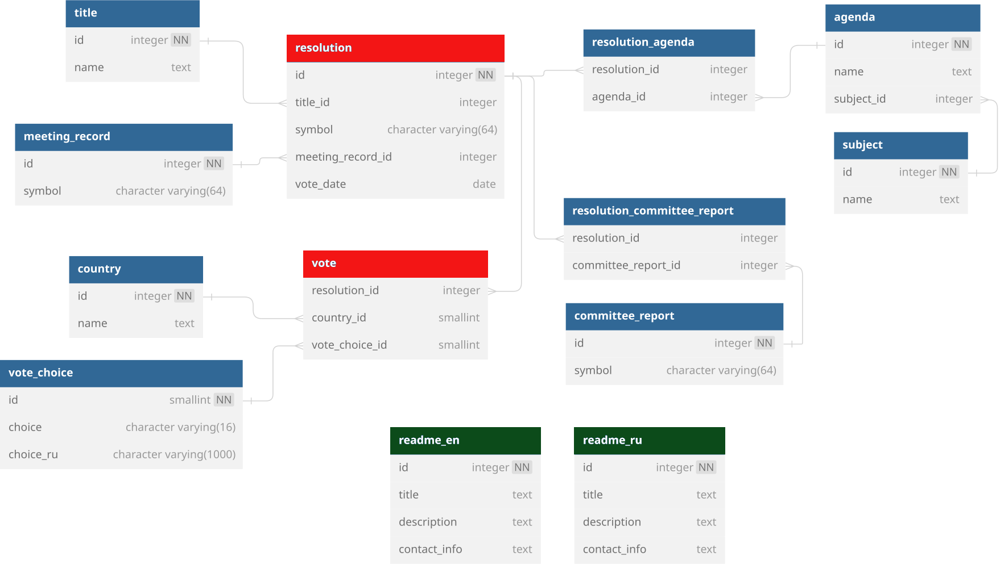
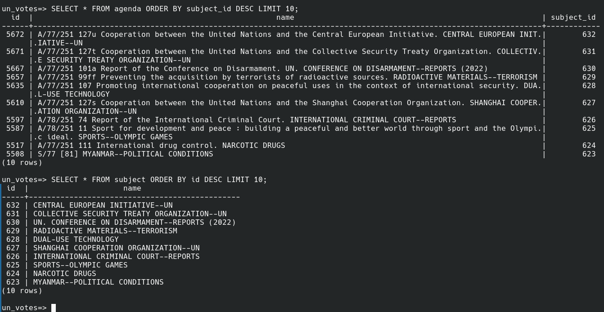

# UN VOTES DATABASE

Author and maintainer: Vadim Rudakov, lefthand67@gmail.com

The "UN votes" Database is a collection of normalized data of the UN voted resolutions' details  from 1946 to 2024 collected from the UN Digital Library. The authors thought this database as the source for machine learning experiments with the international relations data, such as building the predictive models for future votes or clustering countries. That is why the main goal of the database is the countries' vote results. Not all the resolutions presented have this information, but we decided to include the details on all available resolutions for those researchers who would want to conduct other type of analysis where the vote results do not play significant role.

The database is updated about once in a month to incorporate information on the newly voted resolutions, you can find the most recent database version following this link: https://github.com/lefthand67/un_votes

This document covers the technical details of how the database was collected and how you can work with it to get the most out of it.

un_votes=> SELECT * FROM get_database_statistics();
start | end  | sessions | resolutions overall | recorded only | countries | votes
-------+------+----------+---------------------+---------------+-----------+--------
1946 | 2025 |       80 |                9997 |          8337 |       243 | 958652

# <b>Part I. How the database was collected and built</b>

The entire project of building the database can be divided into 3 big parts. 

1. Analysis of the data provided by the UN Digital Library and the database architecture elaboration. We had to decide:
- what kind of data was accessible to us and what kind of data should have really been stored for our purposes,
- how to organize this data to make it easy 1) to update it with the new data, and 2) to work with for analysts,
- what naming and data types we should choose for the database schemata.

"[Architecture](#Architecture)" gives answers on how we solved this problems.

2. Next step involved gathering, processing, and sending the data from the UN Digital Library website to the PostgreSQL database.

For this task we wrote the crawler using the popular Python's "scrapy" module. For sending the data to the database we used another Python's module "psycopg 3". The processing pipeline was written in a way to treat each scrapy's item (i.e. all the details of one resolution) as a transaction, within which all the operations of inserting data and getting the foreign keys for already inserted data either completed successfully or aborted completely. This allowed the maintainer to be sure that all the data was consistent and keep track of bad transactions to rewrite the code during the development and test stage.

3. And the last part was to maintain the system of logs.

This step was essential to have a right to release the database to the community - we could not share the data we did not trust ourselves. Logs system was to control the correctness of two processes: 1) sending the data to the database (client side) and 2) storing the data in the database (server side), and make us be able to trace any kind of corrupted data during the database development step to make changes in the source code. We do not open our source code but we share all the logs so everyone can see the entire way of the data from the website to the database. All the scraping and sending data to the database job was automated, no hand work was implemented at all to exclude any kind of human made mistake. Logs, as the newest database version's dump, can be found here: https://github.com/lefthand67/un_votes.

> Note: When the database had been built we understood that `subject_id` column should be stored only in one table, `agenda`, and we manually removed it from the `resolution_agenda` table. The database pipeline log does not reflect this change and contains the architecture with the `resolution_agenda` containing three columns (`resolution_id`, `agenda_id`, and `subject_id`). Just for mention.   

# <b>Part II. Working with the database</b>

## Architecture

To get the full out of the database, one should understand its architecture. If you have worked with the relational databases before and have the familiarity with the `JOIN` operation, you will quickly grasp the idea of how to work with the database. The maintainers intended to implement the classic "many-to-many" model.

The architecture idea of the database comes from two sources:
- the resolution's available details,
- the strive for the database normalization, i.e. the principle "one string in one place" realization.

This is the example of the typical webpage with the resolution details:

<center>
    
    <p style="text-align: center"><i>Figure 1. UN <a href="https://digitallibrary.un.org/record/278340?ln=en">Resolution page</a> on the UN Digital Library website with the details</i></p>

On the Fig. 2 you can see the attributes that have been processed to the database:

<center>
    
    <p style="text-align: center"><i>Figure 2. Attributes that came into the database on the UN Digital Library website with the details</i></p>

As you may have noticed, no information on "Draft", "Note" and "Vote summary" has been deemed valuable for our purposes. These data contain no additional useful information but would have overloaded the database and slowed down its performance unnecessarily. Regarding the "Vote summary" field, this information can be easily derived from the `vote` table where we store all the votes country by country, so this information should not take its own storage space. Probably, the only reason we should somehow incorporate this information is that "NON-RECORDED" resolutions, i.e. resolutions without country-by-country votes, cannot be identified as accepted or rejected within our database. If there is a real need for such information, we will rewrite the crawler and rebuild the database, but for now this information is not included.

All the highlighted fields keep their names in the database, so you can easily switch between the web-page and the query result when needed.

This is the database final architecture:

<center>
    
    <p style="text-align: center;"><i>Figure 3. UN Votes Database architecture</i></p>

## Tables

Now let's take a look at the tables and their interaction with each other. 

There are 11 tables in the database that contain the UN resolutions data, and also there are 2 additional tables with the general info about the database (`readme_en` and `readme_ru`). This is the list of the the UN data containg tables:

1. `agenda`
1. `committee_report`
1. `country`                     
1. `meeting_record`
1. `resolution`
1. `resolution_agenda`
1. `resolution_committee_report`
1. `subject`
1. `title`
1. `vote`
1. `vote_choice`

You can see the entire list of the tables using command `\dt`, and also you can use `\d` to see the schema of each table, for example:

## `resolution` table

The `resolution` table is the core table - its `resolution.id` attribute binds all the tables together. But if you compare the resolution attributes on the page in the Fig. 1 and the names of tables in the tables' list you will notice that some of these attributes have their own tables and some don't. The `resolution` table has only 5 columns:
- `id` - record number that you can use to quickly find the web page by substituting the "RECORD" word in the url `https://digitallibrary.un.org/record/RECORD?ln=en` with this id (for example, the resolution from the Figure 1 has `id = 278340` and its web address is, then, "https://digitallibrary.un.org/record/278340?ln=en")
- `title_id`,
- `symbol` is the UN documentation standard, see https://research.un.org/en/docs/symbols for details,
- `meeting_record_id`,
- `vote_date`.

<center>
    
    <p style="text-align: center;"><i>Figure 4. <code>resolution</code> table schema</i></p>

### How resolution's attributes are stored 

The `resolution` table has only a few attributes because some resolutions' attributes may have more than one distinct value. There are only three such attributes: `agenda`, `committee_report`, and `vote`, all of them have gotten their own tables for data integrity purposes (see details how to use them in later sections). 

Consider example (see Fig. 5). The resolution with the id `518324` has eight (!) values for agenda. We send these values to the `agenda` table where each new agenda value gets its unique id (do not mention `subject_id` for now):

```sql
un_votes=> SELECT * FROM agenda WHERE id = 3537;
```
```
  id  |                 name                  | subject_id 
------+---------------------------------------+------------
 3537 | S/59 [60] FORMER YUGOSLAVIA SITUATION |        246
(1 row)
```

Then we update an intermediary table called `resolution_agenda` that have two columns - `resolution_id` (the foreign key to `resolution.id`) and `agenda_id` (the foreign key to `agenda.id`):

```sql
un_votes=> SELECT * FROM resolution_agenda WHERE resolution_id = 518324;
```
```
 resolution_id | agenda_id 
---------------+-----------
        518324 |      3536
        518324 |      3537
        518324 |      3553
        518324 |      3578
        518324 |      3579
        518324 |      3580
        518324 |      3581
        518324 |      3582
(8 rows)
```

<center>
    
    <p style="text-align: center"><i>Figure 5. Eight values for <a href="https://digitallibrary.un.org/record/518324?ln=en">agenda</a></i></p>

Here you can see the top 10 resolutions with the highest number of `agenda` values:

```sql
un_votes=> SELECT resolution_id, count(resolution_id) AS cnt 
FROM resolution_agenda 
GROUP BY resolution_id
ORDER BY cnt DESC
LIMIT 10;
```
```
 resolution_id | cnt 
---------------+-----
        518324 |   8
       3979310 |   5
        285170 |   5
       1324646 |   5
        418338 |   5
        285563 |   5
        283223 |   5
        853289 |   5
        574516 |   5
        284150 |   4
(10 rows)
```

and the same rating for `committee_report`:

```sql
un_votes=> SELECT resolution_id, count(resolution_id) AS cnt 
FROM resolution_committee_report
GROUP BY resolution_id
ORDER BY cnt DESC
LIMIT 10;
```
```
 resolution_id | cnt 
---------------+-----
        670663 |   4
        667226 |   4
        663787 |   3
        670297 |   3
        671166 |   3
        664380 |   3
        279828 |   3
        663789 |   3
        670969 |   3
        671254 |   3
(10 rows)
```

### `JOIN` all the attributes

Now we can `JOIN` these tables to get the information view similar to orginal (see Fig. 1) using this query:

```sql
SELECT resolution.id AS record,
       title.name AS title,
       agenda.name AS agenda,
       resolution.symbol AS resolution,
       meeting_record.symbol AS meeting_record,
       committee_report.symbol AS committee_report,
       resolution.vote_date AS vote_date   
FROM resolution
JOIN title ON resolution.title_id = title.id
JOIN resolution_agenda ON resolution.id = resolution_agenda.resolution_id
JOIN agenda ON resolution_agenda.agenda_id = agenda.id
JOIN meeting_record ON resolution.meeting_record_id = meeting_record.id
JOIN resolution_committee_report ON resolution.id = resolution_committee_report.resolution_id
JOIN committee_report ON resolution_committee_report.committee_report_id = committee_report.id
WHERE resolution.symbol ~ '^A'
ORDER BY vote_date DESC
\gx
```

This command will return all the attributes for the resolutions voted in the General Assembly, except for the vote, for each resolution in the descending order:

<center>
    
    <p style="text-align: center"><i>Figure 6. JOIN query result</i></p>

And this command will return the same attributes but also the vote of the Egypt:

```sql
SELECT resolution.id AS record,
       title.name AS title,
       agenda.name AS agenda,
       resolution.symbol AS resolution,
       meeting_record.symbol AS meeting_record,
       committee_report.symbol AS committee_report,
       resolution.vote_date AS vote_date,
       vote.vote_choice_id AS Egypt_vote
FROM resolution
JOIN title ON resolution.title_id = title.id
JOIN resolution_agenda ON resolution.id = resolution_agenda.resolution_id
JOIN agenda ON resolution_agenda.agenda_id = agenda.id
JOIN meeting_record ON resolution.meeting_record_id = meeting_record.id
JOIN resolution_committee_report ON resolution.id = resolution_committee_report.resolution_id
JOIN committee_report ON resolution_committee_report.committee_report_id = committee_report.id
JOIN vote ON resolution.id = vote.resolution_id
WHERE resolution.symbol ~ '^A' AND vote.country_id = (SELECT id FROM country WHERE name ~* '.*egypt*') 
ORDER BY vote_date DESC
\gx
```

<center>
    
    <p style="text-align: center"><i>Figure 7. JOIN query result with the Egypt vote</i></p>

> Note:  `1` in `egypt_vote` means `yes`, see `vote_choice` table.

If you're struggling in understanding this syntax, please, consider learning SQL basic commands and relational databases design models (for example: "[PostgreSQL for Everybody](https://www.coursera.org/specializations/postgresql-for-everybody)").

## `agenda` and `subject` tables

Figure 1 shows no special `subject` field but if you carefully look at the `agenda` string for the resolutions adopted after 1983, you will notice that the last part of the string is capitalized:

<center>
    
    <p style="text-align: center"><i>Figure 8. Agenda strings newer than 1983 examples</i></p>

This is the `subject` that describes the `agenda` in a more general manner so one can use it as an additional tool for filtering the search. The problem is the `subject` as a special part of the `agenda` string has started appearing on a systematic basis only since the 1983 year in the General Assembly resolutions (you can find a few occasional cases in 1960 and 1967 though) and 1985 in the Security Council resolutions. We extracted the `subject` from `agenda` and created an additional table `subject` because this value is used as one of the search filters on the UN Digital Library website and it really can help the analyst in their work (remembering that one can rely on `subject` only for resolutions adopted since 1983!). 

> Note: If there was no pattern for `subject` in the `agenda` filed found, the `subject` got "N/A" default value:

```sql
un_votes=> SELECT * FROM subject LIMIT 5;
```
```
 id |                             name                              
----+---------------------------------------------------------------
  1 | N/A
  2 | UN. GENERAL ASSEMBLY (15TH SESS. : 1960-1961)--GENERAL DEBATE
  3 | MIDDLE EAST SITUATION
  4 | AFRICA--NUCLEAR-WEAPON-FREE ZONES
  5 | WEAPONS OF MASS DESTRUCTION--PROHIBITION--AGREEMENT (DRAFT)
(5 rows)
```

The `agenda` table is bound with the `subject` by the foreign key:

<center>
    
    <p style="text-align: center"><i>Figure 9. Subject and Agenda tables interconnection example</i></p>

The `agenda` table contains three columns:
- `id`, 
- `name`,
- `subject_id`.

The `subject` table contains two columns:
- `id`,
- `name`.

## `committee_report` table

This table contains two columns:
- `id`, and
- `symbol` (UN Documentation standard).

One resolution may have:
- zero,
- one,
- many

`committee_report` values. That is why the additional - `resolution_committee_report` - table was created, designed for binding `resolution.id`s and their corresponding `committee_report.id` values:

```sql
un_votes=> SELECT * FROM resolution_committee_report LIMIT 10;
```
```
 resolution_id | committee_report_id 
---------------+---------------------
        280467 |                   1
        280489 |                   1
        671195 |                   2
        671185 |                   3
        671187 |                   4
        671188 |                   5
        671189 |                   6
        671191 |                   7
        671191 |                   8
        671192 |                   7
(10 rows)
```

## `country` table

As the crawler processed the data year by year starting from 1946 to our days, all the countries got into the `country` table in the order they were represented in the UN bodies: General Assembly and Security Council. Thus, if one calls the query:

```sql
SELECT * FROM country ORDER BY id DESC;
```

they will see the list of countries in the order similar to the one these contries became the members of the UN. By the way, this is not be taken as the ultimate truth: the scaper processed the records not in the straight sequential order, but rather it took two neighboring years and scraped the records from December to January in the backward manner, i.e. from the bigger year to the smaller. For example, the crawler selected 1946 and 1947 years, then it scraped the records through December 1947 to January 1946, then it took 1948 and 1950 and repeated the algorithm. But one can use the above method as a tool for general understanding which countries became the UN members earlier and which later.

The `country` table consists of two columns:
- `id`,
- `name`.

## `meeting_record` table

This table contains two columns:
- `id`, and
- `symbol` (UN Documentation standard).

There can only be one `meeting_record` value for the resolution, but many resolutions may share the same `meeting_record`.

## `title` table

This table also contains two columns:
- `id`, and
- `name`.

There can only be one `title` value for the resolution, but many resolutions may share the same `title`.

## `vote` table

This table has been the main purpose of the database - each contry's vote results that you can use for interesting analyses. 

This table contains only foreign keys:
- `resolution_id`,
- `country_id`,
- `vote_choice_id`

that you can use to get the vote of the country you are interested in for the given resolution. 

## `vote_choice` table

This additional table contains only 4 rows - one row for each possible vote choice: 'yes', 'no', 'abstentions', and 'non-voting'. If you look at the Fig. 1 example, you will see that the `vote` field uses empty string for non-voting countries and 'Y', 'N' and 'A' for other variants. We processed these values, changed them to the numbers on our choice, and created this table with the explanation of the vote result:

```sql
un_votes=> SELECT * FROM vote_choice;
```
```
 id |   choice    |    choice_ru     
----+-------------+------------------
  0 | no          | против
  1 | yes         | за
  2 | abstentions | воздержавшиеся
  3 | non-voting  | без права голоса
(4 rows)
```

If you have any questions or suggestions, feel free to contact the maintainer.

# <b>Part III. SQL queries examples</b>

Use `\pset format wrapped` command to get the lines in console wrapped for the better view experience.

## Database summary information

There is a function (English and Russian versions) in the database that you can use to quickly see the summary information about the database, like the number of sessions, number of recorded resolutions, etc. Just call:

```sql
SELECT * FROM get_database_statistics();
```
and for Russian:
```sql
SELECT * FROM get_database_statistics_ru();
```

This is the syntax of the procedure:

```sql
CREATE OR REPLACE FUNCTION get_database_statistics()
RETURNS TABLE (
    "start" NUMERIC,
    "end" NUMERIC,
    "sessions" BIGINT,
    "resolutions overall" BIGINT,
    "recorded only" BIGINT,
    "countries" BIGINT,
    "votes" BIGINT
) AS $$
BEGIN
    RETURN QUERY
    SELECT
        MIN(EXTRACT(YEAR FROM vote_date)) AS "start",
        MAX(EXTRACT(YEAR FROM vote_date)) AS "end",
        COUNT(DISTINCT EXTRACT(YEAR FROM vote_date)) AS "sessions",
        COUNT(resolution.id) AS "resolutions overall",
        (SELECT COUNT(DISTINCT(resolution_id)) FROM vote) AS "recorded only",
        (SELECT COUNT(name) FROM country) AS "countries",
        (SELECT COUNT(*) FROM vote) AS "votes"
    FROM resolution;
END;
$$ LANGUAGE plpgsql;

CREATE OR REPLACE FUNCTION get_database_statistics_ru()
RETURNS TABLE (
    "начало" NUMERIC,
    "конец" NUMERIC,
    "сессии" BIGINT,
    "резолюции всего" BIGINT,
    "резолюции с голосами" BIGINT,
    "страны" BIGINT,
    "голоса" BIGINT
) AS $$
BEGIN
    RETURN QUERY
    SELECT
        MIN(EXTRACT(YEAR FROM vote_date)) AS "начало",
        MAX(EXTRACT(YEAR FROM vote_date)) AS "конец",
        COUNT(DISTINCT EXTRACT(YEAR FROM vote_date)) AS "сессии",
        COUNT(resolution.id) AS "резолюции всего",
        (SELECT COUNT(DISTINCT(resolution_id)) FROM vote) AS "резолюции с голосами",
        (SELECT COUNT(name) FROM country) AS "страны",
        (SELECT COUNT(*) FROM vote) AS "голоса"
    FROM resolution;
END;
$$ LANGUAGE plpgsql;
SELECT * FROM get_database_statistics_ru();
```

## `JOIN` all details, except for `vote`

```sql
SELECT resolution.id AS record,
       title.name AS title,
       agenda.name AS agenda,
       subject.name AS subject,
       resolution.symbol AS resolution,
       meeting_record.symbol AS meeting_record,
       committee_report.symbol AS committee_report,
       resolution.vote_date AS vote_date   
FROM resolution
JOIN title ON resolution.title_id = title.id
JOIN resolution_agenda ON resolution.id = resolution_agenda.resolution_id
JOIN agenda ON resolution_agenda.agenda_id = agenda.id
JOIN subject ON agenda.subject_id = subject.id
JOIN meeting_record ON resolution.meeting_record_id = meeting_record.id
JOIN resolution_committee_report ON resolution.id = resolution_committee_report.resolution_id
JOIN committee_report ON resolution_committee_report.committee_report_id = committee_report.id
\gx
```

## `JOIN` all details only for GA, except for `vote`

```sql
SELECT resolution.id AS record,
       title.name AS title,
       agenda.name AS agenda,
       subject.name AS subject,
       resolution.symbol AS resolution,
       meeting_record.symbol AS meeting_record,
       committee_report.symbol AS committee_report,
       resolution.vote_date AS vote_date   
FROM resolution
JOIN title ON resolution.title_id = title.id
JOIN resolution_agenda ON resolution.id = resolution_agenda.resolution_id
JOIN agenda ON resolution_agenda.agenda_id = agenda.id
JOIN subject ON agenda.subject_id = subject.id
JOIN meeting_record ON resolution.meeting_record_id = meeting_record.id
JOIN resolution_committee_report ON resolution.id = resolution_committee_report.resolution_id
JOIN committee_report ON resolution_committee_report.committee_report_id = committee_report.id
WHERE resolution.symbol ~ '^A'
\gx
```

## `JOIN` `vote` results of one `country` for each resolution

For example Egypt, in descending order by date

```sql
SELECT resolution.id AS record,
       title.name AS title,
       agenda.name AS agenda,
       subject.name AS subject,
       resolution.symbol AS resolution,
       meeting_record.symbol AS meeting_record,
       committee_report.symbol AS committee_report,
       resolution.vote_date AS vote_date,
       vote.vote_choice_id AS Egypt_vote
FROM resolution
JOIN title ON resolution.title_id = title.id
JOIN resolution_agenda ON resolution.id = resolution_agenda.resolution_id
JOIN agenda ON resolution_agenda.agenda_id = agenda.id
JOIN subject ON agenda.subject_id = subject.id
JOIN meeting_record ON resolution.meeting_record_id = meeting_record.id
JOIN resolution_committee_report ON resolution.id = resolution_committee_report.resolution_id
JOIN committee_report ON resolution_committee_report.committee_report_id = committee_report.id
JOIN vote ON resolution.id = vote.resolution_id
WHERE vote.country_id = (SELECT id FROM country WHERE name ~* '.*egypt*')
ORDER BY vote_date DESC
\gx
```

## Get the records from the special year

```sql
SELECT * FROM resolution 
WHERE EXTRACT(YEAR FROM vote_date) = 2024;
```

## Count the number of values in the resolution's field

For example, let's count the number of `committee_report` values for each resolution in descending order:

```sql
SELECT resolution_id, COUNT(resolution_id) AS cnt 
FROM resolution_committee_report 
GROUP BY resolution_id 
ORDER BY cnt DESC;
```

and filter only those resolutions that contain more than 2 `committee_report` values:
```sql
SELECT resolution_id, COUNT(*) AS cnt
FROM resolution_committee_report
GROUP BY resolution_id
HAVING COUNT(*) > 2
ORDER BY cnt DESC;
```

## Show the `agenda` from a particular year

Let's see `agenda` in the General Assembly resolutions since 1983:

```sql
SELECT r.id as resolution, a.name as agenda, r.vote_date
FROM agenda a
JOIN resolution_agenda ra ON a.id = ra.agenda_id
JOIN resolution r ON r.id = ra.resolution_id
WHERE EXTRACT(YEAR FROM r.vote_date) > 1982
    AND R.symbol ~* '^a'
ORDER BY r.vote_date;
```

and for the Security Council since 1985:

```sql
SELECT r.id as resolution, a.name as agenda, r.vote_date
FROM agenda a
JOIN resolution_agenda ra ON a.id = ra.agenda_id
JOIN resolution r ON r.id = ra.resolution_id
WHERE EXTRACT(YEAR FROM r.vote_date) > 1984
    AND R.symbol ~* '^s'
ORDER BY r.vote_date;
```

## Save the result in csv

For example, save the `subject` values into a special table:

```sql
\copy (
    SELECT DISTINCT ON (subject.name)         
        subject.name AS subject,
        EXTRACT(YEAR FROM resolution.vote_date) AS year
    FROM agenda                                    
    JOIN subject ON agenda.subject_id = subject.id                                                                         
    JOIN resolution_agenda ON resolution_agenda.agenda_id = agenda.id 
    JOIN resolution ON resolution.id = resolution_agenda.resolution_id
    ORDER BY subject.name, year
) TO '~/UN_Analysis/subjects.csv' WITH CSV HEADER;
```

# <b>Misc</b>

## Indexes

There are two B-Tree indexes created, one for year and another for month in `resolution` relation:

```sql
-- index for years
CREATE INDEX year_b ON resolution(EXTRACT (YEAR FROM vote_date));

-- index for months
CREATE INDEX month_b ON resolution(EXTRACT (MONTH FROM vote_date));
```
